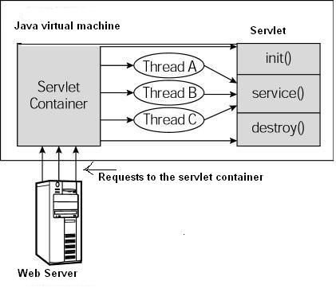

## 名词解释
Web容器，也叫Web服务器、HTTP服务器、HTTP中间件，指的是为Web应用提供中间通信服务的软件。在Java开发者口中，也叫做Servlet容器。
Tomcat、Jetty等HTTP服务软件都是Web容器、Web服务器、HTTP服务器、HTTP中间件。

# Servlet
Java Servlet 是运行在 Web服务器上的后端程序，它是作为来自 Web 浏览器或其他 HTTP 客户端的请求和 HTTP 服务器上的数据库或应用程序之间的中间层。
使用 Servlet 可以处理HTTP请求，收集来自网页表单的数据，呈现来自数据库或者其他源的数据，还可以动态创建网页。

Servlet 指的是继承了HttpServlet类或实现了Servlet接口的Java类。Java类库的全部功能对 Servlet 来说都是可用的。
它可以通过网络、IO、JDBC等技术实现与其它软件进行交互。

JavaSE开发时，main方法是程序运行的主入口，要运行一个类，就需要给这个类写一个main方法。
Servlet类不需要写main方法，它需要继承HttpServlet类或实现Servlet接口，重写或实现特定的方法。
这些实现方法是由Web容器（Tomcat）来自动调用的。

## Servlet 提供了那些方法？
- init()：Servlet初始化时调用，仅被调用一次，常用来做一些初始化的操作，如：创建线程池等。
- destroy()：Servlet销毁时调用，仅被调用一次，常用来做一些资源回收的操作，如：关闭线程池等。
- service()：可以处理各种请求方法的 HTTP 请求，每次HTTP请求都调用一次

- doGet()：仅处理请求方法为 GET 的 HTTP 请求，每次HTTP请求都调用一次
- doPost()：仅处理请求方法为 POST 的 HTTP 请求，每次HTTP请求都调用一次
- doPut()：仅处理请求方法为 PUT 的 HTTP 请求，每次HTTP请求都调用一次
- doDelete()：仅处理请求方法为 DELETE 的 HTTP 请求，每次HTTP请求都调用一次

## Web容器如何调用Servlet方法？
Tomcat启动后，会依据配置来创建Servlet对象，每个Servlet实现类只实例化一次。注意：实例化一次！
Tomcat处理HTTP请求时，会使用一个线程来调用匹配URL请求的Servlet对象的service方法，service方法会根据请求方法来调用doXxx方法来处理请求。

**注意： Servlet实例是多个线程的共享资源，开发时需要考虑线程安全的问题。需要考虑线程安全的问题！**

## Servlet什么时候被实例化？
Servlet实例化的时间节点，由loadOnStartup参数决定：
- loadOnStartup为负数时：Web容器（Tomcat）启动时 **不实例化**，首次被调用时做实例化。
- loadOnStartup为正数时：Web容器（Tomcat）启动时**按数字由小到大的顺序进行实例化**。
- loadOnStartup为零时：Web容器（Tomcat）启动时，0被视作最大正数，**最后被实例化**。
- 如果没有设置loadOnStartup的值，则loadOnStartup的值默认为-1，Web容器（Tomcat）启动时 **不实例化**。

Web容器（Tomcat）实例化Servlet时，会调用Servlet的init方法。

## 谁来处理Servlet方法抛出的异常？
方法未捕获的异常会继续向上抛出给本方法的调用者，Servlet方法的调用者是Web容器（Tomcat）的线程。
Web容器捕获异常后，会将HTTP响应码设为500服务器内部错误，并把异常信息打印到错误页面。

让用户看到错误信息很不友好，而且容易泄露程序代码，容易被黑客抓住漏洞进行攻击，因此开发时要注意异常拦截。