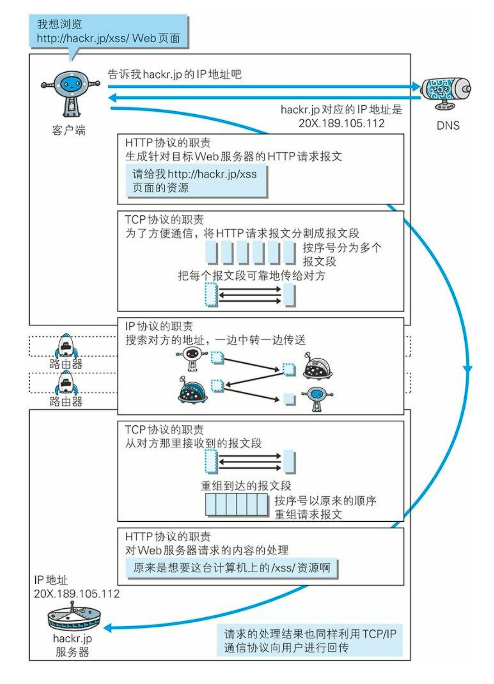
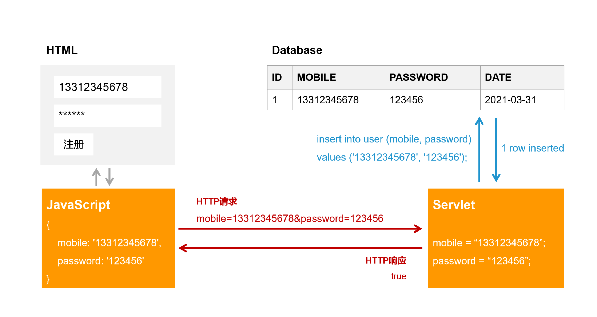
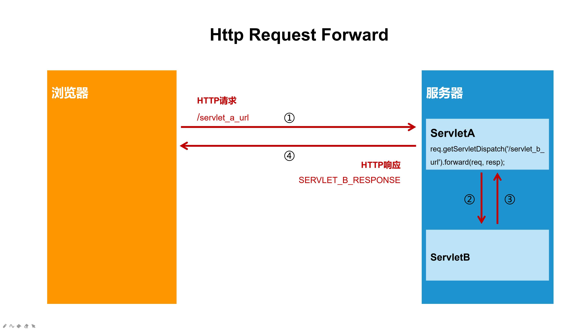
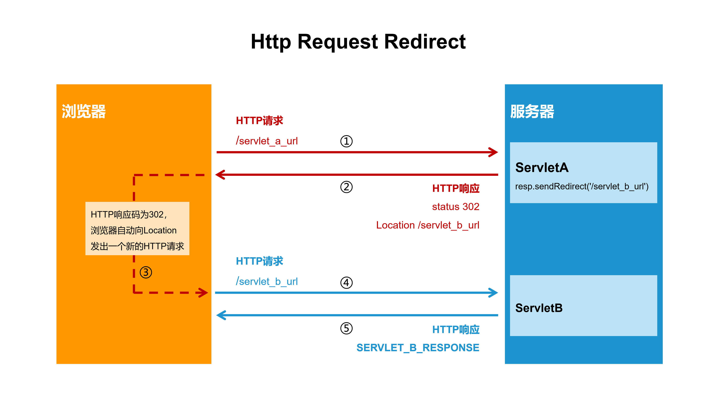

## HTTP 请求和响应
HTTP（Hypertext Transfer Protocol）是客户端和服务器之间的请求-响应协议，
客户端（如浏览器）向服务器发送 HTTP 请求，然后服务器将响应返回客户端。

## 1、请求方法（Request Method）
### 1.1 GET 方法
GET是最常见的 HTTP 请求方法，用于从服务端请求资源和数据。
在浏览器输入网址或点击网页链接，都会向对应的服务器发出GET请求，
如访问网址` http://www.baidu.com `就会向百度服务器发出GET请求。

GET请求支持UrlEncoded形式传参，参数会拼接在请求URL的末尾（以?符号开始），参数以 param=value 的形式拼接，
多个参数之间用&符号来拼接。 例如：
请求` http://www.baidu.com/s?wd=Java&rsv_idx=1 `时，就会在请求
` http://www.baidu.com/s `的同时向服务器传递2个参数，参数wd的值为Java，参数rsv_idx的值为1。

GET请求的特点：
- GET 请求可被浏览器缓存
- GET 请求有长度限制
- GET 请求保留在浏览器历史记录中
- GET 请求可被浏览器收藏

### 1.2 POST 方法
POST 用于将数据发送到服务器来创建/更新资源，也是最常见的HTTP请求方法之一。
常见的应用如用户注册、报名、提交申请等表单提交操作，一般都是POST请求。
POST请求发送到服务器的数据存储在HTTP协议的body中，不会体现在浏览器的URL中。

POST 请求的特点：
- POST 请求不会被缓存
- POST 请求不会保留在浏览器历史记录中
- POST 不能被收藏为书签
- POST 请求对数据长度没有要求

### 1.3 PUT 方法
PUT 用于将数据发送到服务器来创建/更新资源。
PUT 和 POST 的区别在于 PUT 请求是幂等的（idempotent），重复调用相同的 PUT 请求将始终得到相同的结果。
相反，重复调用POST请求，则可能会导致多次创建相同资源的副作用。

### 1.4 DELETE 方法
DELETE 方法用于删除指定的资源。

### 1.5 GET 与 POST 的区别
|               |GET            |POST           |
|---            |---            |---            |
|书签           |可收藏为书签    |不可收藏为书签  |
|浏览器缓存     |能被缓存        |不能缓存        |
|数据长度	   |URL的最长2048个字符， GET方法参数会添加到URL中， 传递数据量有限|URL的最长2048个字符， 提交的数据放在HTTP协议的body中， 没有长度限制|
|数据可见性     |数据体现在URL中对所有人可见|数据不会显示在URL中|
|数据类型       |仅支持字符|没有限制|
|后退/刷新      |无害           |数据会被重新提交（浏览器会告知用户数据会被重新提交）|

**注意：请求传参如果含有密码或其他敏感信息时，不要使用 GET ！**

## 2、响应码（Response Status）
- 2xx: 成功
- 3xx: 重定向
- 4xx: 客户端错误
- 5xx: 服务器错误

|status |含义                    |中文含义|
|---    |---                     |--- |
|2xx    |OK                      |成功|
|301    |Moved Permanently       |所请求的资源已经永久地转移至新的url|
|302    |Found                   |所请求的资源已经在本地缓存中找到|
|307    |Temporary Redirect      |被请求的资源已经临时移至新的url|
|400    |Bad Request             |服务器未能理解请求|
|401    |Unauthorized            |被请求的资源需要授权后（用户名和密码）才能访问|
|403    |Forbidden               |对被请求资源的访问被禁止|
|404    |Not Found               |服务器无法找到被请求的资源|
|405    |Method Not Allowed      |请求中指定的方法不被允许|
|500    |Internal Server Error   |服务器遇到不可预知的情况|
|502    |Bad Gateway             |服务器从上游服务器收到一个无效的响应|
|503    |Service Unavailable     |服务器临时过载或宕机|
|504    |Gateway Timeout         |请求超时|

## 3、HTTP请求

## 4、请求的转发和重定向（Forward和Redirect）
用户向服务器发送了一次HTTP请求，该请求可能会经过多个信息资源处理以后才返回给用户，
各个信息资源使用请求转发机制相互转发请求。 根据转发方式的不同，可以区分为转发(Forward)和重定向(Redirect)。

### 4.1 转发（Request Forward）

### 4.2 重定向（Request Redirect）

### 4.3 总结
转发是服务器行为，重定向是客户端行为。

- Forward：A找B借钱，B没钱于是B去找C借，借到就给A。  
  Forward是服务器直接访问目标地址的URL，把那个URL的响应内容读取过来，然后把这些内容再发给浏览器。浏览器根本不知道服务器发送的内容是从哪儿来的，所以它的地址栏中还是原来的地址。
- Redirect：A找B借钱，B说“我没有，你可以找C去借”，然后A转身去找C借钱。  
  Redirect是服务端将302状态码和新的URL告诉浏览器，浏览器会用刚才请求的所有参数重新请求新的URL，浏览器的地址栏变成新的URL。

## 5、Session和Cookie

## 5.1 Session
由于HTTP协议是无状态的协议，典型的场景比如个人中心，所以服务端并不知道当前HTTP请求是哪个用户。
服务端需要记录用户的状态时，就需要用某种机制来识具体的用户，Session就是这种机制之一。  
服务端可以为每个用户生成唯一的Session，用于标识这个用户。
服务端生成Session后，服务端会把SessionID通过HTTP响应告诉客户端，客户端以后每次请求把这个SessionID发送到服务器，
服务端就能识别当前HTTP请求的用户是谁了。

## 5.1 Cookie
客户端如何把SessionID发送到服务器，这个时候就需要用到Cookie。  
Cookie是存储在客户端（浏览器）的一份数据，每次HTTP请求的时候，客户端都会将存储的Cookie信息到作为HTTP请求头发送到服务端，
所以Cookie可用来记录SessionID，帮助服务端维持Session。

## 5.3 总结
- Session默认保存在服务端的内存（Tomcat关闭后就会丢失），用来跟踪用户的状态，这个数据可以保存在集群、数据库、文件中； 
- Cookie保存在客户端（浏览器），用来记录用户的一些信息，辅助服务端进行用户识别。
